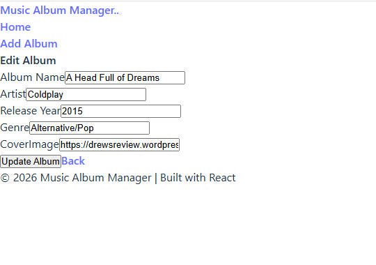
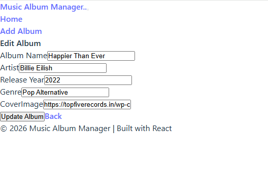
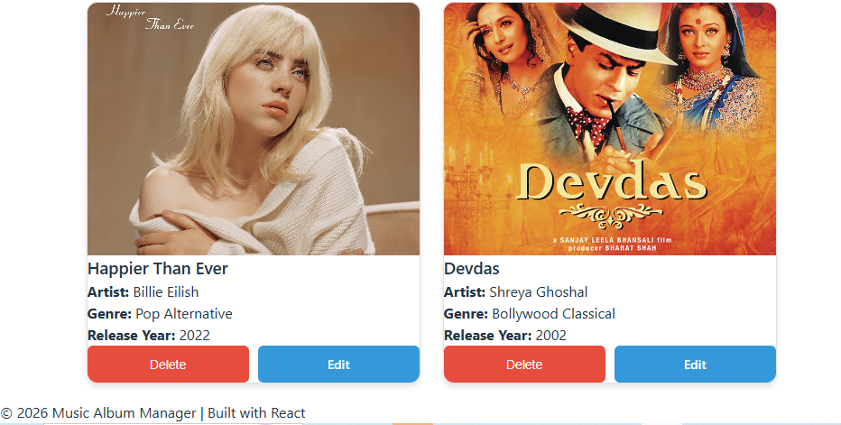
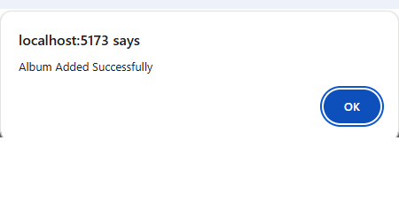
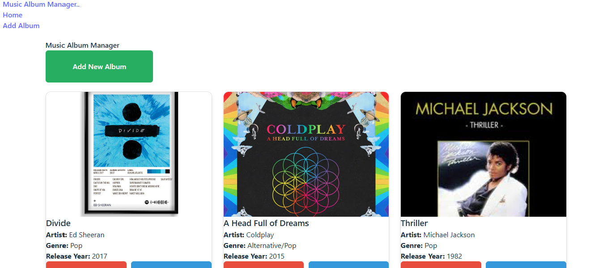
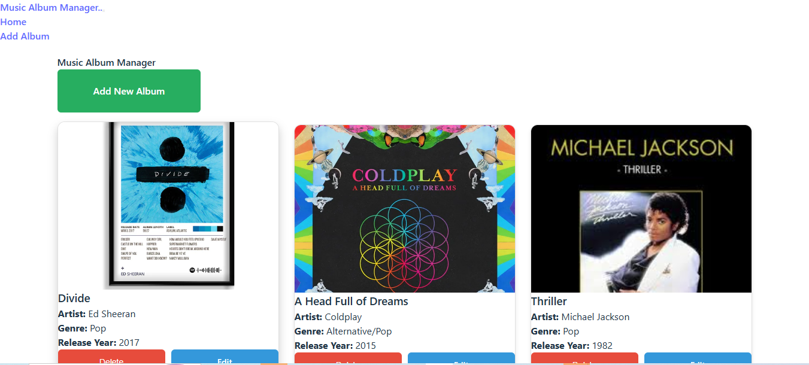

# Music Album Manager - MERN Stack Project

## Description
A full-stack web application for managing music albums built with MERN stack (MongoDB, Express.js, React, Node.js).

## Features
- Add, Edit, and Delete Albums
- Music Album Management
- User-friendly Interface

## Project Screenshots

### Add Album Feature

### Edit Album Feature

### Delete Album Feature

### Album Success

### Music Album Manager

### Final Album

## Technologies Used
- *Frontend:* React.js
- *Backend:* Node.js, Express.js
- *Database:* MongoDB
